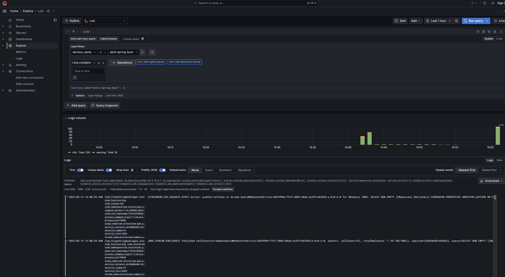

## Logs

### Configuration

I'm using logback for the logging, see the configuration here: `src/main/resources/logback-spring.xml`.<br>
The logs are pushed to the collector thanks to the `logback-appender`, check the details in the `application.yml`:

```yaml
  instrumentation:
    logback-appender:
      experimental:
        capture-marker-attribute: true
        capture-key-value-pair-attributes: true
        capture-code-attributes: true
        capture-logger-context-attributes: true
        capture-mdc-attributes: "*"
      experimental-log-attributes: true
```

### How to observe

I export the logs from the collector to Loki, this is how we can query them, make sure you select the right `service_name`, this
is the `service.name` we used in the `application.yml`:

```yaml
otel:
  metric:
    export:
      interval: 1s
  traces:
    sampler: always_on
  resource:
    attributes:
      '[service.name]': ${spring.application.name}
      '[service.version]': 1.0
```
Note that you can turn on `Prettify JSON`:



### Links

- [https://opentelemetry.io/docs/instrumentation/java/manual/#logs](https://opentelemetry.io/docs/instrumentation/java/manual/#logs)
- [https://opentelemetry.io/docs/specs/otel/logs/](https://opentelemetry.io/docs/specs/otel/logs/)
- [https://github.com/open-telemetry/opentelemetry-java-instrumentation/tree/main/instrumentation/logback/logback-appender-1.0/library](https://github.com/open-telemetry/opentelemetry-java-instrumentation/tree/main/instrumentation/logback/logback-appender-1.0/library)

