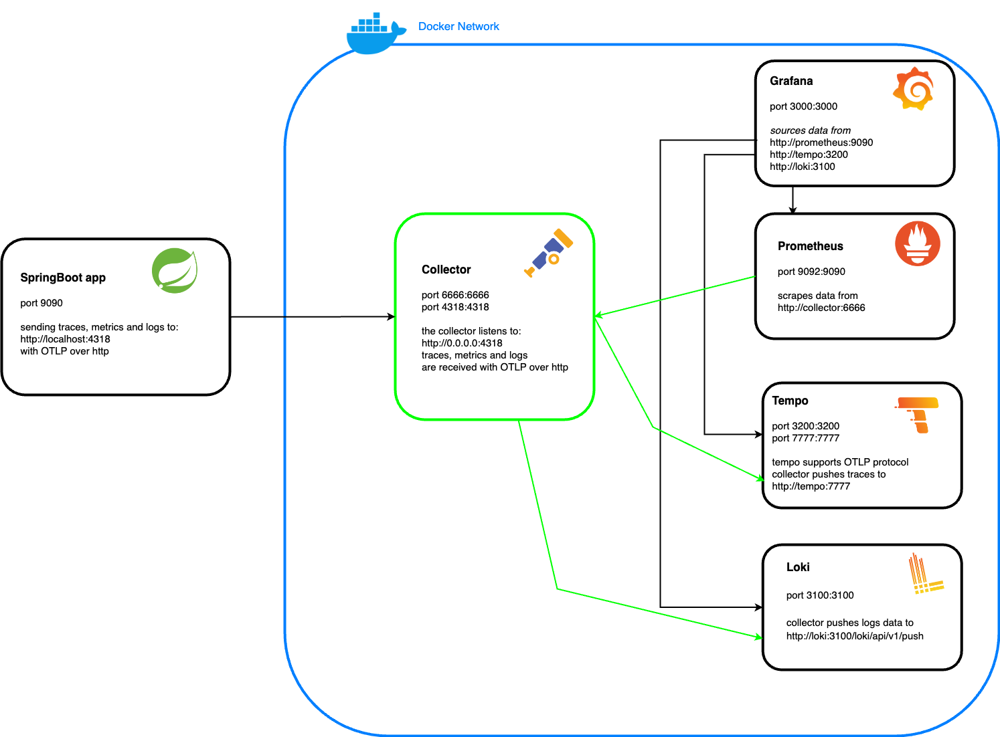

## The OTEL stack



### Run

We assume that you know how to use Docker and that Docker is installed on your machine,
see [https://www.docker.com/products/docker-desktop/](https://www.docker.com/products/docker-desktop/).<br>
Run `docker compose up -d` from the folder `otel/otel-stack`. This will start the whole environment defined in the
schema
above.

### Configuration

The `docker-compose.yaml` located under `otel/otel-stack` is the file having the configuration of all the
containers that you can see in the schema above.<br>
Note that thanks to the OpenTelemetry collector, the Spring Boot app should not be aware of all the observability tools.
The Spring Boot app will send the traces, metrics and logs to the collector on the default port `4318` with the OTLP (
OpenTelemetry protocol) over http.<br>
The configuration is telling your application where the collector is `http://localhost:4318`, what we are sending to the
collector (traces, logs and metrics) and how (OTLP), this is the default for a Spring Boot app.

The configuration of OpenTelemetry for our Spring Boot app is in the `application.yml`:

```yaml
otel:
  metric:
    export:
      interval: 1s
  traces:
    sampler: always_on
  resource:
    attributes:
      '[service.name]': ${spring.application.name}
      '[service.version]': 1.0
```

Note that instead of having this in the `application.yml` we could have done this with the following, 
note that the 4 first parameters are the one by default:

#### Environment variables

```bash
export OTEL_TRACES_EXPORTER=otlp
export OTEL_METRICS_EXPORTER=otlp
export OTEL_LOGS_EXPORTER=otlp
export OTEL_EXPORTER_OTLP_ENDPOINT=http://localhost:4318
export OTEL_TRACES_SAMPLER=always_on # collects all traces regardless of the sampling rate
export OTEL_METRIC_EXPORT_INTERVAL=1000
export OTEL_RESOURCE_ATTRIBUTES=service.name=atoti-spring-boot,service.version=1.0
```

#### Java jvm arguments

```
-Dotel.traces.exporter=otlp
-Dotel.metrics.exporter=otlp
-Dotel.logs.exporter=otlp
-Dotel.exporter.otlp.endpoint=http://localhost:4318
-Dotel.traces.sampler=always_on
-Dotel.metric.export.interval=1000
-Dotel.resource.attributes=service.name=atoti-spring-boot,service.version=1.0
```

## Collector

Let's check how the collector is configured:


In our case the collector we are using is based on this
image:
`otel/opentelemetry-collector-contrib` [https://github.com/open-telemetry/opentelemetry-collector-contrib](https://github.com/open-telemetry/opentelemetry-collector-contrib),
the configuration of the collector is located in this file `otel/otel-stack/collector-config-local.yaml`.<br>
As you say in the schema above, we need to define the `receivers`, the source of the collector, in my case this is the
Spring Boot app which sends the traces, logs and metrics with OTLP over gRCP.<br>
The received traces, logs and metrics are exported to different tools:

- The traces are exported to Tempo (with OTLP).
- The logs are exported to Loki (push to an endpoint).
- We DO NOT push the metrics to Prometheus, the collector provides an endpoint to Prometheus and every 15 seconds
  Prometheus scrapes the metrics.

Note that we can have more than one application sending information to the collector.<br>
You can use any tools compatible with OpenTelemetry, you need for that to amend the `collector-config-local.yaml` file.

### Traces

[Traces](./TRACES.md)

### Metrics

[Metrics](./METRICS.md)

### Logs

[Logs](./LOGS.md)

## Links

- [https://opentelemetry.io/docs/collector/](https://opentelemetry.io/docs/collector/)
- [https://github.com/open-telemetry/opentelemetry-java/blob/main/sdk-extensions/autoconfigure/README.md#exporters](https://github.com/open-telemetry/opentelemetry-java/blob/main/sdk-extensions/autoconfigure/README.md#exporters)
- [https://github.com/open-telemetry/opentelemetry-java-examples](https://github.com/open-telemetry/opentelemetry-java-examples)
- [https://opentelemetry.io/ecosystem/vendors/](https://opentelemetry.io/ecosystem/vendors/)
- [https://opentelemetry.io/docs/concepts/sdk-configuration/otlp-exporter-configuration/](https://opentelemetry.io/docs/concepts/sdk-configuration/otlp-exporter-configuration/)
- [https://opentelemetry.io/docs/collector/scaling/](https://opentelemetry.io/docs/collector/scaling/)
